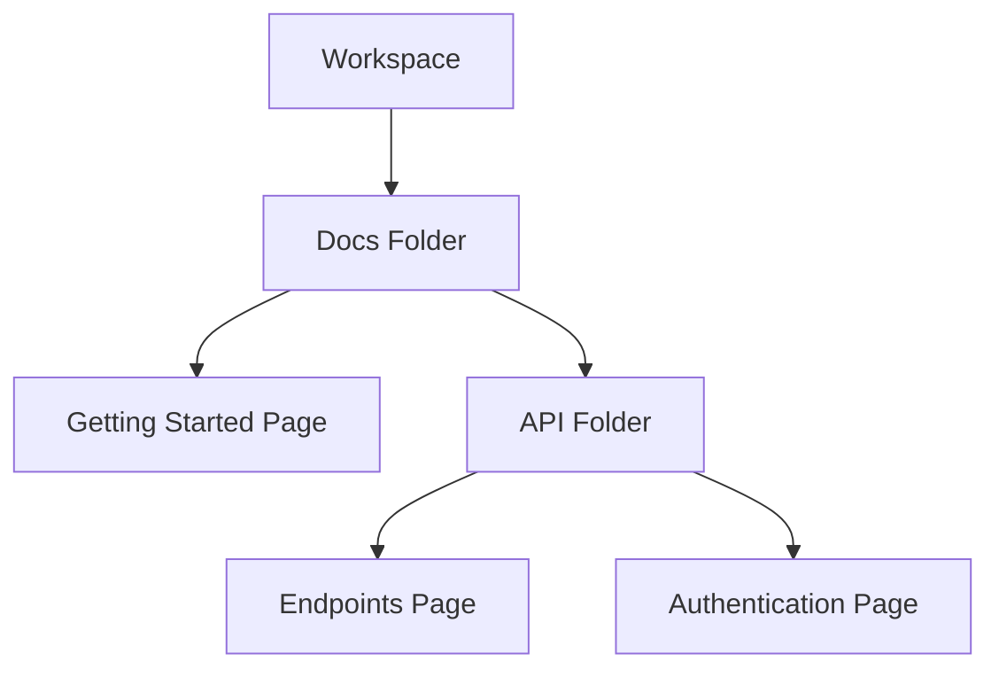

## Overview

U17g provides powerful tools to manage your documentation efficiently. You organize content into pages and folders, collaborate with teams using granular permissions, track changes with version history, and discover information quickly through advanced search.

<Columns cols={2}>
  <Card title="Organize Content" icon="folder" href="#organizing-content">
    Structure your docs with intuitive pages and folders.
  </Card>
  <Card title="Collaborate Securely" icon="users" href="#collaboration">
    Manage team access and contributions seamlessly.
  </Card>
  <Card title="Track Changes" icon="git-branch" href="#version-control">
    Maintain history and revert changes easily.
  </Card>
  <Card title="Search Effectively" icon="search" href="#search">
    Find content instantly across your documentation.
  </Card>
</Columns>

## Organizing Content with Pages and Folders

Create a hierarchical structure for your documentation using pages and folders. Folders group related pages, while pages hold your MDX content.

<Steps>
  <Step title="Create a Folder" icon="folder-plus">
    Navigate to your workspace and select **New Folder**. Name it descriptively, such as `API Reference`.
  </Step>
  <Step title="Add Pages" icon="file-plus">
    Inside the folder, click **New Page**. Use the editor to add headings, code blocks, and components.
  </Step>
  <Step title="Rearrange Structure" icon="move">
    Drag and drop pages or folders to reorganize your hierarchy.
  </Step>
</Steps>



<Callout kind="tip">
  Use consistent naming conventions like `verb-noun` for pages to improve navigation.
</Callout>

## Collaboration and Permissions

Invite team members and control access with role-based permissions. You assign roles to manage who can view, edit, or publish content.

<Tabs>
  <Tab title="Viewer" icon="eye">
    Read-only access. Ideal for stakeholders.
  </Tab>
  <Tab title="Editor" icon="edit">
    Create and modify pages. Cannot publish.
  </Tab>
  <Tab title="Admin" icon="shield">
    Full access including permissions and publishing.
  </Tab>
</Tabs>

| Role     | View | Edit | Publish | Manage Permissions |
|----------|------|------|---------|--------------------|
| Viewer   | ✅   | ❌   | ❌      | ❌                 |
| Editor   | ✅   | ✅   | ❌      | ❌                 |
| Admin    | ✅   | ✅   | ✅      | ✅                 |

<Callout kind="alert">
  Regularly review permissions to ensure security. Revoke access for former team members promptly.
</Callout>

## Version Control and History

U17g tracks every change automatically. You view diffs, restore previous versions, and compare edits.

<Expandable title="Advanced Version Features" default-open="false">
  Access history via the page menu. Select **View History** to see a timeline of changes.

  Restore a version by clicking **Revert**. Create branches for experimental edits without affecting the main content.
</Expandable>

## Search and Content Discovery

Use full-text search to find pages, sections, or code snippets instantly. Filters refine results by folder, tag, or date.

<Tabs>
  <Tab title="Basic Search">
    Type keywords in the global search bar. Results appear with previews.
  </Tab>
  <Tab title="Advanced Filters">
    Combine terms: `auth AND api filter:folder="API"`.
  </Tab>
</Tabs>

<CodeGroup tabs="Query Examples">
  ```plaintext
  authentication
  ```
  ```plaintext
  error handling filter:code
  ```
  ```plaintext
  "user permissions" since:2024-01-01
  ```
</CodeGroup>

Start by organizing your first folder, then invite collaborators to build your documentation together. Explore these features hands-on to streamline your workflow.